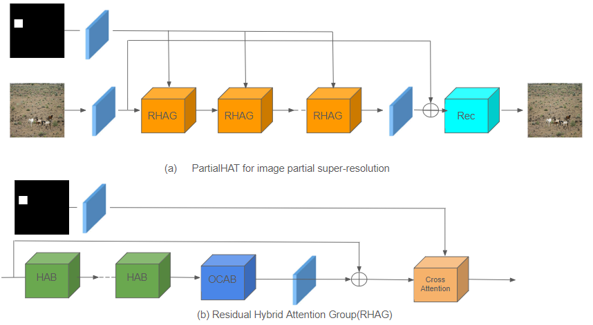
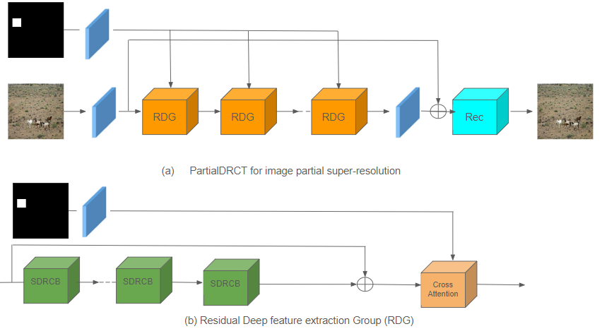
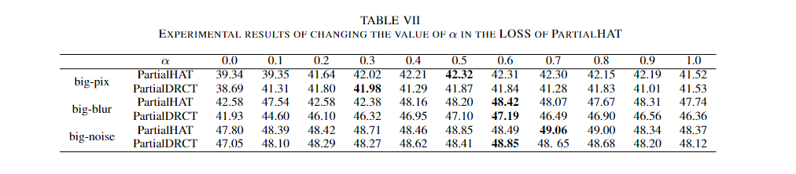
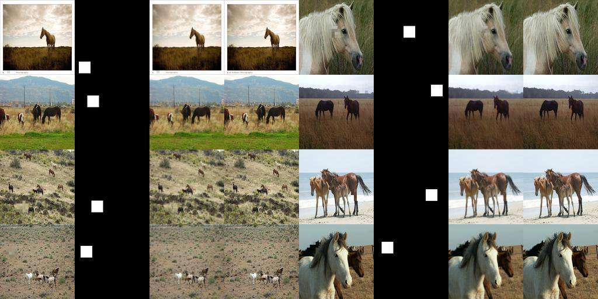

# Partial Super Resolution
This is the official implementation of the paper "Partial Super Resolution using Cross Attention"

## PartialHAT


## PartialDRCT



## Abstract
We propose the task of *partial super-resolution* and introduce two methods for the task, PartialHAT and PartialDRCT.
Partial super-resolution is the task of enhancing the resolution of a specific region of an image.
For this task, we incorporated cross attention and a novel loss function into the existing super-resolution models, HAT and DRCT. Experimental results demonstrate that our approach outperforms the original methods, HAT and DRCT, in terms of PSNR. Additionally, we conducted experiments by altering the hyperparameter values of the loss function.

## Result



## Environment Installation
```
conda env create -n "ENVIRONMENT NAME" -f env.yml
conda activate "ENVIRONMENT NAME"
```

## Training
```
cd partial-hat
python train.py
```
```
cd partial-drct
python train.py
```
## Inference
```
cd partial-hat
python test.py
```
```
cd partial-drct
python test.py
```

## References
- https://github.com/XPixelGroup/HAT
- https://github.com/ming053l/DRCT